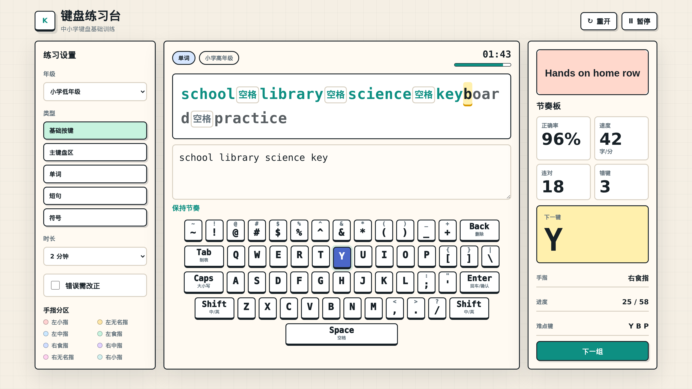

# 键盘练习台 · Keyboard Practice

面向中小学生的网页版键盘练习工具。支持分级题库、可视化键位、手指分区提示，以及实时的正确率与速度统计。

[](https://jeffreywfu-alt.github.io/keyboard-practice/)
[](LICENSE)

## 在线体验 / Live Demo

**https://jeffreywfu-alt.github.io/keyboard-practice/**



## 功能特点

- **三档难度**：小学低年级 / 小学高年级 / 初中，自动调整题目长度与难度。
- **五种练习模式**：基础按键、主键盘区、单词、短句、符号。
- **可视化键盘**：高亮下一键，按手指分区上色，错按瞬时反馈。
- **节奏板**：实时显示正确率、速度（字/分）、最长连对、错键次数和难点键 Top 3。
- **中文输入法防呆**：检测到中文输入时弹出提示，引导按 Shift 切回英文。
- **可控时长**：1 / 2 / 3 / 5 分钟可选；支持暂停、重开、下一组。
- **错误必改模式**：勾选后必须改对当前键才能继续，用于打基础。
- **无依赖、纯静态**：单一 HTML + CSS + JS，无构建步骤。

## 运行方式

### 在线打开（推荐）

直接访问 GitHub Pages：<https://jeffreywfu-alt.github.io/keyboard-practice/>

### 本地运行

```bash
git clone https://github.com/jeffreywfu-alt/keyboard-practice.git
cd keyboard-practice
# 任选其一：
open index.html              # macOS 直接打开
python3 -m http.server 8000  # 本地服务器
```

打开浏览器访问 `http://localhost:8000` 即可。

## 项目结构

```
keyboard-practice/
├── index.html       # 页面骨架
├── styles.css       # 视觉与布局
├── app.js           # 练习逻辑、键盘渲染、统计
├── assets/
│   ├── keyboard-guide.svg
│   └── preview.png
└── LICENSE          # MIT
```

## 浏览器要求

现代浏览器即可：Chrome / Edge / Safari / Firefox 最近两个大版本。

## 贡献

欢迎提交 Issue 或 Pull Request：

- 增加题库内容（不同年级的字词/短句）
- 优化键盘视觉与动效
- 新增练习模式（如听写、计时挑战）

## 许可证

[MIT](LICENSE) © 2026 Jeffery.W.Fu
